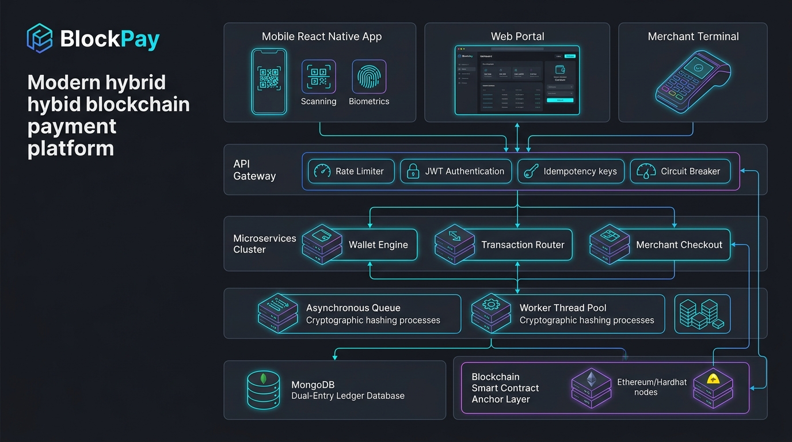
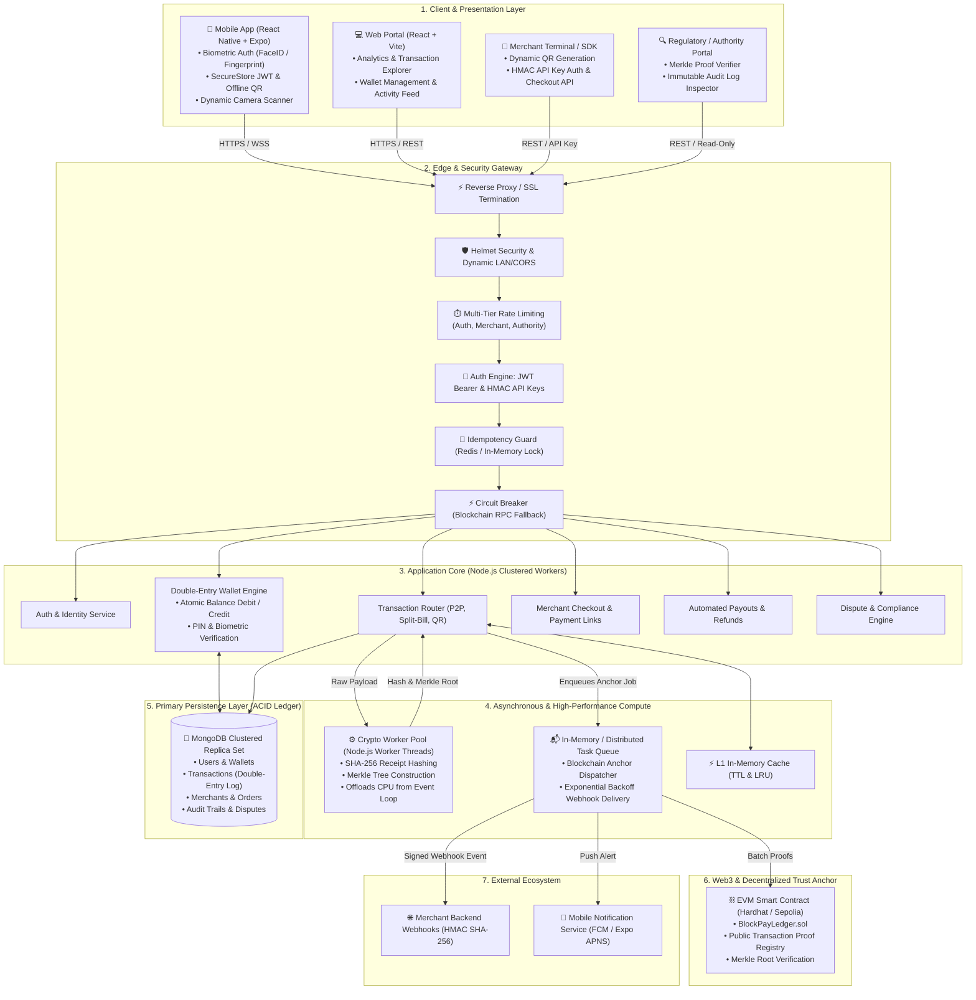
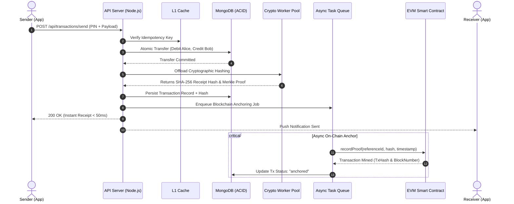
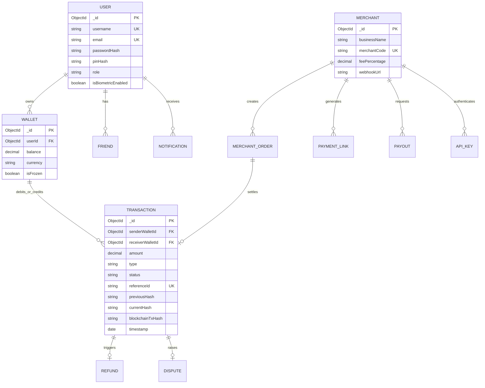

# BlockPay: Enterprise Hybrid Blockchain Architecture

**BlockPay** is an enterprise-grade, high-throughput digital payments ecosystem designed around a **hybrid off-chain/on-chain settlement architecture**:

* **Off-Chain Real-Time Settlement (< 50ms):** High-velocity double-entry ledger execution running on an ACID-compliant MongoDB database cluster, offering instant P2P transfers, QR scan-to-pay, merchant point-of-sale checkout, bill splitting, and automated payouts.
* **On-Chain Trust & Immutability Anchor:** Cryptographic proof generation (SHA-256 state hashing and Merkle proofs) offloaded to multi-threaded worker pools and asynchronously batched onto an EVM-compatible smart contract ledger (Ethereum / Sepolia / Hardhat).
* **Zero Direct Blockchain Exposure:** Clients never hold private signing keys or interact directly with the blockchain RPC; all interactions are mediated through a hardened API Gateway with rate limiting, HMAC signing, and circuit breaker fault isolation.

---

## 2. End-to-End Architecture Diagram

---

## 3. High-Velocity Payment Lifecycle

---

## 4. Entity-Relationship & Double-Entry Schema

---

## 5. Security & Fault Tolerance Model

* **Idempotency Defense:** `X-Idempotency-Key` headers stored in Redis/In-Memory cache to prevent double-charging on network retries.
* **Worker Thread Isolation:** Compute-heavy SHA-256 and Merkle hashing run in isolated worker threads (`cryptoPool.js`), ensuring non-blocking event-loop response times.
* **Circuit Breaker:** Automatically trips during blockchain RPC congestion or network downtime, buffering proofs locally without interrupting instant off-chain transaction settlement.
* **Zero-Key Client Exposure:** Mobile clients authenticate using biometric-secured JWTs; private blockchain keys remain strictly held in server HSM/secure environment.
