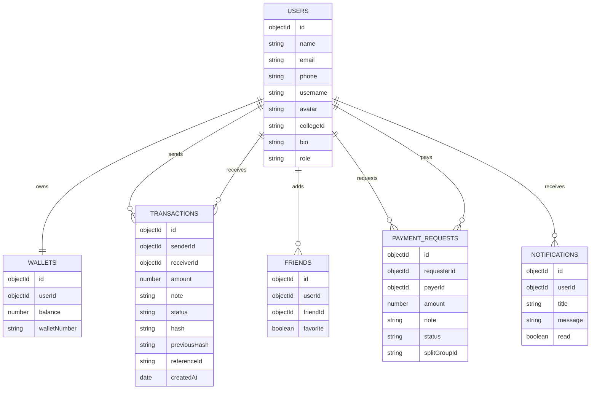

# ERD

```mermaid
erDiagram
  USERS ||--|| WALLETS : owns
  USERS ||--o{ TRANSACTIONS : sends
  USERS ||--o{ TRANSACTIONS : receives
  USERS ||--o{ FRIENDS : adds
  USERS ||--o{ PAYMENT_REQUESTS : requests
  USERS ||--o{ PAYMENT_REQUESTS : pays
  USERS ||--o{ NOTIFICATIONS : receives

  USERS {
    objectId id
    string name
    string email
    string phone
    string username
    string avatar
    string collegeId
    string bio
    string role
  }

  WALLETS {
    objectId id
    objectId userId
    number balance
    string walletNumber
  }

  TRANSACTIONS {
    objectId id
    objectId senderId
    objectId receiverId
    number amount
    string note
    string status
    string hash
    string previousHash
    string referenceId
    date createdAt
  }

  PAYMENT_REQUESTS {
    objectId id
    objectId requesterId
    objectId payerId
    number amount
    string note
    string status
    string splitGroupId
  }

  FRIENDS {
    objectId id
    objectId userId
    objectId friendId
    boolean favorite
  }

  NOTIFICATIONS {
    objectId id
    objectId userId
    string title
    string message
    boolean read
  }
```
